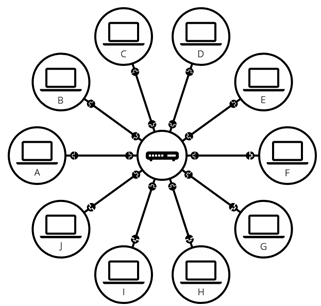
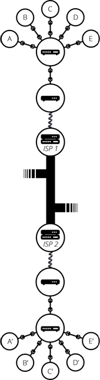
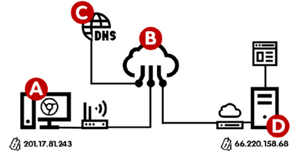
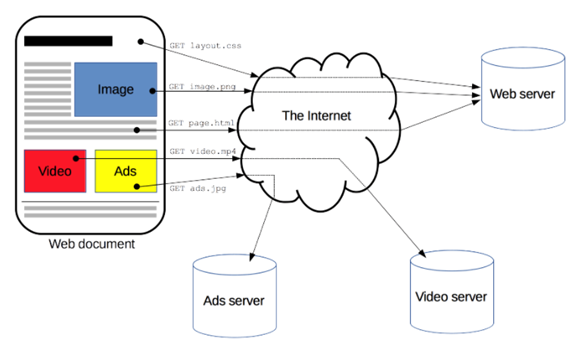
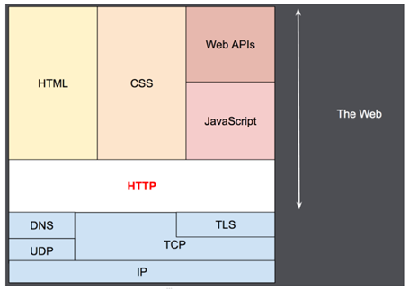
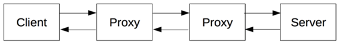
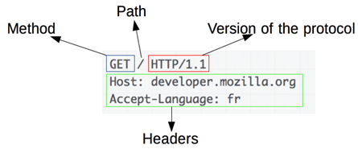
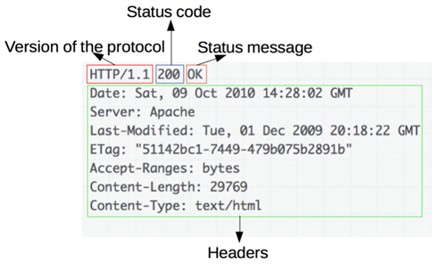

## Minhas anotações sobre a Internet e a Web :globe_with_meridians:

Referências utilizadas para o desenvolvimento dessas anotações estão disponíveis [aqui](#references).

# ÍNDICE

[O QUE É A INTERNET](#internet)

[INTERNET *vs.* WEB](#internet_vs_web)

[COMO A INTERNET FUNCIONA](#como_internet_funciona)

[ENCONTRANDO COMPUTADORES](#encontrando_computadores)

[ACESSANDO UM SERVIDOR](#acessando_servidor)

[ENTENDENDO OS PROTOCOLOS](#protocolos)

[COMO A WEB FUNCIONA](#web)

[MENSAGENS HTTP](#http)

[MÉTODOS DE SOLICITAÇÃO HTTP (<em>REQUEST METHODS</em>)](#metodos_solicitacao)

[CÓDIGOS DE <em>STATUS</em> DE RESPOSTAS HTTP](#codigos_status)

<h2> O QUE É A INTERNET </h2>

A Internet é uma rede de computadores que se comunicam e se conectam entre si para enviar pequenos pacotes de dados contendo informações. Ou seja, a Internet é uma rede de redes interconectadas. **Inter**, de interconectadas, e **network**, de rede -> **Internetwork** ou simplesmente **INTERNET**! 

<h2> INTERNET <em>vs.</em> WEB </h2>

A Internet é a infraestrutura técnica que conecta bilhões de computadores em uma rede mundial. É possível vê-la como os fios e cabos que transportam as informações ao redor do mundo. A Web vive dentro da estrutura que a Internet oferece. Então a Web é tudo o que passa pela Internet, via protocolo HTTP. Assim, podemos dizer que a Internet é a infraestrutura, enquanto a Web é um serviço construído sob esta infraestrutura.

**INTERNET:** é a rede de computadores.

**WEB:**  é um sistema de documentos interligados que são acessados na internet através de um **navegador;** é o famoso WWW (World Wide Web).

<h2> COMO A INTERNET FUNCIONA</h2>

Nós precisamos de meios físicos para levar essas informações (sinais) de um lado para outro. Assim, a Internet é algo físico, feita essencialmente de cabos que passam por debaixo da terra e do mar e conectam casas, países e continentes. É através dessa infraestrutura de cabos que nossos pequenos pacotes de dados vão trafegar, indo de um computador a outro. 

### Uma rede simples:

Podemos conectar dois ou mais computadores, para que eles possam se comunicar, através de cabos (cabo de rede) ou de uma forma sem fio (WiFi ou Bluetooth, por exemplo). Cada computador na rede está conectado à um pequeno computador especial chamado de *roteador.* Roteadores direcionam o tráfego da Internet, ajudando os pacotes de dados a chegar no seu destino. 

### Uma rede de redes:

Para conectar centenas, milhares, bilhões de computadores podemos conectar computadores a roteadores, e então roteadores a roteadores, escalando infinitamente a rede. Mas como é inviável ligarmos cabos entre nossas casas e o resto do mundo, nós usamos os cabos já existem ligados às nossas casas, como por exemplo, cabos de eletricidade e telefone. A estrutura do telefone já conecta nossa casa com o resto do mundo. Para conectar nossa rede a rede telefônica, precisamos de um equipamento especial chamado *modem.* Este *modem* transforma a informação da nossa rede em uma informação gerenciável pela rede telefônica e vice-versa.

Então nós estamos conectados à infraestrutura telefônica. O próximo passo é enviar mensagens da nossa rede para a rede que nós desejamos alcançar. Para fazer isto, vamos precisar conectar nossa rede a um Provedor de Serviço de Internet (*Internet Service Provider* - ISP). Um ISP é uma companhia que gerencia alguns roteadores especiais que são conectados e pode também acessar roteadores de outros ISPs. Então a mensagem da nossa rede é transportada para a rede de redes do ISP e então para a rede de destino. A Internet é composta por toda esta infraestrutura de redes.

### O caminho da internet:

O caminho que a Internet faz até chegar ao usuário passa por quatro passos principais, os quais são sempre identificados por um endereço de IP:

- Backbone
- Provedor de acesso
- Provedor de serviço
- Usuário final

**BACKBONE:** estes backbones são pontos das redes que compõem o núcleo das redes de Internet. São pontos-chave da Internet que distribuem pelas redes as informações baseadas na tecnologia TCP/IP. Existem poucos backbones espalhados pelo mundo, e estes são os responsáveis por distribuir o acesso mundial para a rede de Internet.

**PROVEDOR DE ACESSO:** a partir dos backbones, a Internet passa para uma nova etapa, quando o seu sinal chega aos provedores de acesso (as empresas que contratam o sinal de backbones para distribuir aos seus usuários). Os provedores de acesso são, em geral, empresas ligadas ao setor de telecomunicações, ou até mesmo as próprias companhias telefônicas, que fornecem o acesso à Internet por meio de planos acordados com seus usuários.

**PROVEDOR DE SERVIÇO:** estes dados de Internet que trafegarão na rede necessitam de um meio para o seu transporte até os usuários, e são as empresas provedoras de serviço as responsáveis por este papel. Estas empresas recebem os dados do provedor de acesso e distribuem aos usuários por variados meios, seja por linha telefônica, fibra ótica ou via rádio (por tecnologia sem fio).

**USUÁRIO FINAL:** este pode parecer o passo final do caminho percorrido pela Internet, mas na verdade não é. Ao chegar no usuário final o sinal de Internet passa a repetir todo o caminho novamente, porém na forma inversa, já que o usuário final, também envia sinais (com as suas requisições) para a Internet.

<h2> ENCONTRANDO COMPUTADORES</h2>

Para enviar uma mensagem para um computador, é preciso especificar qual é este computador. Por isso, qualquer computador conectado à uma rede possui um único endereço de identificação, chamado de "Endereço IP" (*Internet Protocol*). 

Os IPs mais antigos (**IPv4**) usam 4 octetos, que são conjuntos de 8 bits separados por pontos, totalizando 32 bits por identificador. Os IPs mais modernos (**IPv6**), usam 128 bits ao todo (o que é 4x mais bits que o IPv4).

<h2> ACESSANDO UM SERVIDOR</h2>

Vamos imaginar um simples cenário: você está no ponto A e quer acessar o site que está guardado no servidor, que é o ponto D. É possível observar que ambos têm seus próprios IPs. Contudo, não é fácil decorar o IP. E é para isso que existe o **DOMAIN NAME SYSTEM (DNS)**, ou sistema de nomes de domínio. Eles são como grandes “listas telefônicas”, criando uma ligação entre o nome do site e o número de IP relacionado a ele. Assim, o passo-a-passo desse acesso é:

1. Você está no **ponto A** (conectado à Internet) e digita o endereço do site que está querendo acessar (ex.: [www.facebook.com](http://www.facebook.com))
2. A arquitetura da Internet (**ponto B**) vai encontrar o **Servidor DNS** que terá o registro do IP referente ao nome que você digitou
3. O Servidor DNS, que é o **ponto C**, vai resolver o endereço e retornar o IP atual do site que você pediu
4. Uma vez que seu navegador já sabe o IP que deseja acessar, vai poder se direcionar diretamente ao servidor correto
5. Assim que chega uma solicitação ao **ponto D**, ele vai procurar a página solicitada e te enviar uma cópia do documento para o seu computador.
6. Agora que o seu computador no **ponto A** tem o arquivo HTML, vai poder analisá-lo para descobrir que arquivos extras ele vai precisar (fotos, vídeos, estilos, etc.). A partir daí ele vai fazer outras solicitações ao **ponto D**, para que ele possa enviar esses recursos extras. É por conta disso que os sites que você visita vão aparecendo aos poucos.

<h2> ENTENDENDO OS PROTOCOLOS</h2>

Para que esse emaranhado de redes, cabos e dados funcione, a Internet é estruturada a partir de vários protocolos. 

**TCP/IP:** para que os computadores consigam se comunicar, eles utilizam uma “língua” comum chamada TCP/IP (*Transmission Control Protocol*/*Internet Protocol*). São protocolos de comunicação que definem como os dados trafegam pela web. Todo dispositivo (computador, celular, tablet) conectado à rede recebe um número de IP, para que os dispositivos possam identificar uns aos outros. Cada página na Internet também possui um IP, para que possamos nos conectar a elas.

**HTTP E HTTPS:** para acessar uma página, utilizamos também um protocolo de comunicação chamado HTTP (*HyperText Transfer Protocol*), que é um conjunto de regras que permitem ao seu computador trocar informações com um servidor que abriga uma página. Isso significa que, uma vez conectados sob esse protocolo, os dispositivos podem receber e enviar qualquer conteúdo textual — os códigos que resultam na página acessada pelo navegador (chrome, firefox…).

O protocolo HTTP define, entre outras formalidades, como são requisitadas as páginas da Web, como são enviados os dados que uma pessoa insere em formulários de *login* e como o servidor envia mensagens de erro para o navegador de quem está acessando. No entanto, como o HTTP é um protocolo baseado em texto, ou seja, toda a informação transmitida está em texto, os dados de uma pessoa que usa a internet e do servidor podem ser interceptados ou alterados no meio do caminho. 

Nesse sentido, um novo protocolo foi pensado e desenvolvido, o HTTPS. Ele insere uma camada de proteção na transmissão de dados entre seu computador e o servidor. Em páginas com endereço HTTPS, a comunicação é criptografada, aumentando significativamente a segurança dos dados. O HTTPS também é importante para autenticar a página acessada.

<h2> COMO A WEB FUNCIONA</h2>

Computadores conectados à web são chamados de **clientes** e **servidores**.

**CLIENTES:** são os típicos dispositivos conectados à internet dos usuários da web (por exemplo, seu computador conectado ao seu Wi-Fi ou seu telefone conectado à sua rede móvel) e programas de acesso à Web disponíveis nesses dispositivos (geralmente um navegador como Firefox ou Chrome).

**SERVIDORES:** são computadores que armazenam páginas, sites ou aplicativos. Quando o dispositivo de um cliente quer acessar uma página, uma cópia dela é baixada do servidor para a máquina do cliente para ser apresentada no navegador web do usuário.

A Web vive dentro da estrutura que a Internet oferece. Então a Web é tudo o que passa pela Internet, via protocolo HTTP. Esse protocolo é baseado em um sistema simples:

* A máquina a partir da qual você deseja acessar uma página da web é chamada de **cliente**
* A máquina que hospeda o conteúdo do site é chamada de **servidor**
* O cliente envia uma **solicitação HTTP** ao servidor, com a URL da página a ser aberta
* O servidor processa esta solicitação e envia de volta uma **resposta HTTP** ao cliente, com o conteúdo da página
* O cliente processa esta resposta e exibe a página da web

**Qualquer ação em um site aciona uma solicitação HTTP**. Não importa se você digita uma URL na barra de endereço, clica em um link ou envia um formulário, sua ação aciona uma solicitação HTTP enviada pelo cliente ao servidor.

Se o conteúdo solicitado na solicitação HTTP for **ESTÁTICO** (como um site de notícias simples, por exemplo) o servidor basicamente irá ler o conteúdo do arquivo HTML correspondente no disco rígido e o enviará de volta ao cliente por meio da resposta HTTP.

Se o conteúdo for **DINÂMICO**, por exemplo, se o conteúdo do arquivo HTML for diferente para dois usuários conectados diferentes (como em duas páginas de perfil do Facebook), não será tão simples. O servidor precisa ser mais inteligente. Ele precisa “falar” uma linguagem de programação de back-end (pode ser Java, Python, Ruby...). Com o conteúdo dinâmico, a solicitação HTTP é processada pelo código de back-end. Este código provavelmente consultará um banco de dados e, finalmente, construirá o arquivo HTML com o conteúdo correto. Em seguida, ele enviará o arquivo HTML de volta ao cliente por meio da resposta HTTP.

Entre o cliente e o servidor existem inúmeras entidades, chamadas coletivamente de **proxies**, que realizam diferentes operações e atuam como gateways ou **caches**, por exemplo. 

**SERVIDOR PROXY:** é um programa ou computador intermediário usado ao navegar por diferentes redes da Internet. Eles facilitam o acesso ao conteúdo da World Wide Web. Um proxy intercepta solicitações e devolve respostas; pode encaminhar os pedidos, ou não (por exemplo no caso de uma cache), e pode modificá-la (por exemplo alterar os seus cabeçalhos, na fronteira entre duas redes). Pode estar no computador local do usuário ou em qualquer lugar entre o computador do usuário e um servidor de destino na Internet.

**CACHE:** (cache da web ou cache HTTP) é um componente que armazena respostas HTTP temporariamente para que possa ser usado para solicitações HTTP subsequentes, desde que atenda a certas condições.

Na realidade, há mais computadores entre um navegador e o servidor que trata da solicitação: há roteadores, modems e muito mais. Graças ao design em camadas da Web, eles estão ocultos nas camadas de rede e de transporte. O HTTP está no topo, na camada do aplicativo. Embora importante para diagnosticar problemas de rede, as camadas subjacentes são principalmente irrelevantes para a descrição de HTTP.

<h2> MENSAGENS HTTP</h2>

As mensagens HTTP, conforme definidas em HTTP/1.1 e anteriores, são legíveis por humanos. No HTTP/2, essas mensagens são embutidas em uma estrutura binária, um quadro (frame), permitindo otimizações como compactação de cabeçalhos e multiplexação (técnica utilizada para permitir que mais de uma mensagem ocupe o mesmo meio de transporte). Mesmo que apenas parte da mensagem HTTP original seja enviada nesta versão do HTTP, a semântica de cada mensagem permanece inalterada e o cliente reconstitui (virtualmente) a solicitação HTTP/1.1 original. Portanto, é útil compreender mensagens HTTP/2 no formato HTTP/1.1.

Existem dois tipos de mensagens HTTP, **solicitações** e **respostas**, cada uma com seu próprio formato.

**SOLICITAÇÕES (REQUESTS):** consistem nos seguintes elementos:

* Um **método HTTP**, geralmente um verbo como GET, POST ou um substantivo como OPTIONS ou HEAD que define a operação que o cliente deseja realizar. Normalmente, um cliente deseja buscar um recurso (usando GET) ou postar o valor de um formulário HTML (usando POST), embora mais operações possam ser necessárias em outros casos.
* O caminho do recurso a ser buscado; a URL do recurso removido de elementos que são óbvios do contexto, por exemplo, sem o protocolo (http: //), o domínio ou a porta TCP.
* A versão do protocolo HTTP.
* Cabeçalhos opcionais que transmitem informações adicionais para os servidores.
* Ou um corpo, para alguns métodos como o POST, semelhantes aos das respostas, que contêm o recurso enviado.

**RESPOSTAS (RESPONSES):** consistem nos seguintes elementos:

- A versão do protocolo HTTP que eles seguem.
- Um **código de status**, indicando se a solicitação foi bem-sucedida ou não e por quê.
- Uma mensagem de status, uma breve descrição não autorizada do código de status.
- Cabeçalhos HTTP, como aqueles para solicitações.
- Opcionalmente, um corpo contendo o recurso buscado.

<h2> MÉTODOS DE SOLICITAÇÃO HTTP (<em>REQUEST METHODS</em>)</h2>

O HTTP define um conjunto de métodos de solicitação para indicar a ação desejada a ser executada para um determinado recurso. Embora também possam ser substantivos, esses métodos de solicitação às vezes são chamados de verbos HTTP. Cada um deles implementa uma semântica diferente, mas algumas características comuns são compartilhadas por um grupo deles: por exemplo, um método de solicitação pode ser seguro, idempotente ou armazenável em cache.

- **GET:** O método GET solicita uma representação do recurso especificado. As solicitações que usam GET devem recuperar apenas dados.
- **HEAD:** O método HEAD pede uma resposta idêntica à de um pedido GET, mas sem o corpo da resposta.
- **POST:** O método POST é usado para enviar uma entidade ao recurso especificado, geralmente causando uma mudança no estado ou efeitos colaterais no servidor.
- **PUT:** O método PUT substitui todas as representações atuais do recurso de destino pela carga útil da solicitação.
- **DELETE:** O método DELETE exclui o recurso especificado.
- **CONNECT:** O método CONNECT estabelece um túnel para o servidor identificado pelo recurso de destino.
- **OPTIONS:** O método OPTIONS é usado para descrever as opções de comunicação para o recurso de destino.
- **TRACE:** O método TRACE executa um teste de loopback de mensagem ao longo do caminho para o recurso de destino.
- **PATC:** O método PATCH é usado para aplicar modificações parciais a um recurso.

<h2> CÓDIGOS DE <em>STATUS</em> DE RESPOSTAS HTTP</h2>

Os códigos de *status* das respostas HTTP indicam se uma requisição HTTP foi corretamente concluída. As respostas são agrupadas em cinco classes:

- **Classe de status 1xx – INFORMATIVA:** indica que a solicitação foi recebida e que o servidor está pronto para dar continuidade ao processo. Os códigos mais comuns são: 100 Continuar; 102 Processando.

- **Classe de status 2xx – SUCESSO:** indica que a solicitação foi recebida, entendida e que será processada com êxito pelo servidor. Os códigos mais comuns são: 200 OK; 202 Aceito.

- **Classe de status 3xx –** **REDIRECIONAMENTO:** indica que você será redirecionado a outra página. Isso acontece, por exemplo, quando a URL que você pesquisou foi alterada, mas o administrador do site te redireciona para a página atual. Dessa forma, surgem os erros 3xx. Os códigos mais comuns são: 301 Movido Permanentemente; 302 Encontrado; 307 Redirecionamento Temporário.

- **Classe de status 4xx –** **ERRO DO CLIENTE:** indica que o servidor não conseguiu processar a solicitação porque o cliente a fez de forma errada ou que não dependa dele, como por exemplo uma página excluída. Os códigos mais comuns são: 400 Requisição Inválida; 401 Não autorizado; 403 Proibido; 404 Não encontrado.

- **Classe de status 5xx –** **ERRO DO SERVIDOR:** indica que, por um erro do servidor, a sua solicitação não pode ser atendida. Na maioria das vezes está relacionada a permissões dos arquivos ou pastas de software. Os códigos mais comuns são: 500 Erro interno do servidor; 502 Bad Gateway.

  

<h1> REFERÊNCIAS </h1>

https://medium.com/cuidados-integrais/como-a-internet-funciona-2936e6c7053e 

https://developer.mozilla.org/pt-BR/docs/Learn/Getting_started_with_the_web/How_the_Web_works#clientes_e_servidores

https://developer.mozilla.org/pt-BR/docs/Learn/Com%E2%80%93mon_questions/How_does_the_Internet_work

https://anarute.gitbooks.io/web-design-para-iniciantes/content/introducao_a_internet/README.html

https://www.techtudo.com.br/noticias/noticia/2011/07/como-internet-chega-na-sua-casa.html

https://developer.mozilla.org/pt-BR/docs/Web/HTTP/Overview

https://www.homehost.com.br/blog/internet/status-http-o-que-sao-codigos-de-resposta/

https://github.com/gustavoguanabara/html-css/blob/master/aulas-pdf/02%20-%20Como%20funciona%20a%20Internet.pdf

